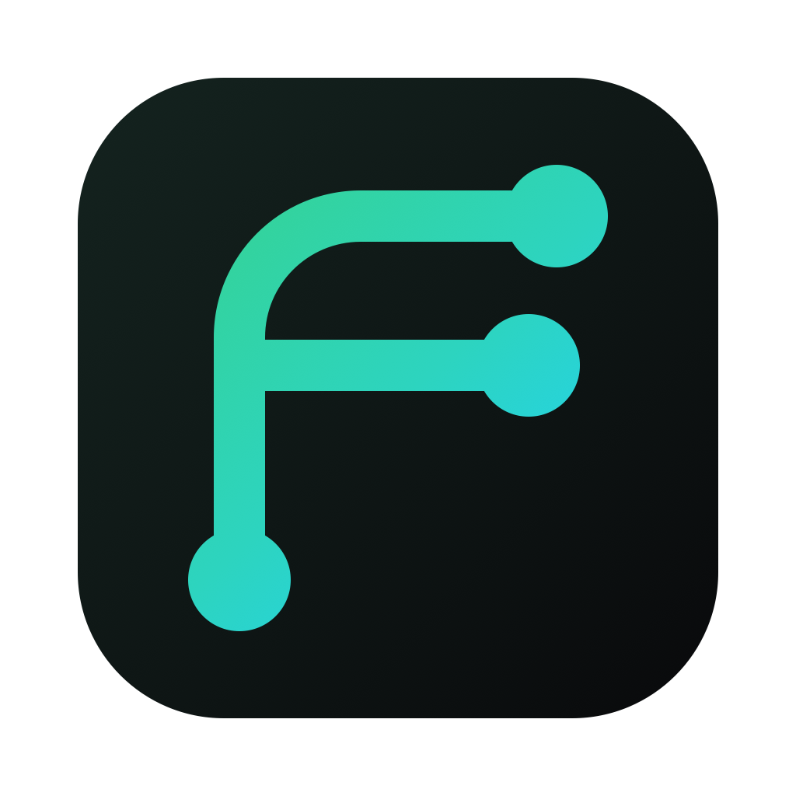

# Frigg

**A mobile app debugging toolkit for Android and iOS.**

Debug from network traffic to device state: inspect requests, run API calls, mock or pause exchanges, stream logs, browse on-device databases, and use advanced tools from one desktop workspace.

Frigg is free and open source, with an English and Brazilian Portuguese interface.

[Download the desktop app](https://github.com/frigg-tools/frigg-desktop/releases/latest) · [What Frigg does](#what-frigg-does) · [Português (Brasil)](./README.pt-BR.md)

## What Frigg does

### Network debugging

- **Traffic** — inspect HTTP(S) requests live, filter by host, path, or device, and open headers and bodies.
- **API client** — manage requests in workspaces, folders, and environments; use variables, tabs, pre-request scripts, and tests.
- **Breakpoints** — pause matching requests or responses, edit them in flight, then continue, replace the response, or abort.
- **Mocks** — match rules by method, URL, query, and body; return custom status, headers, content, and delay.

### Device diagnostics

- **Device setup** — configure Android emulators and iOS simulators in a few clicks. Physical phones can connect through a QR setup page.
- **Logs** — stream Android logcat and iOS logs, filtered by app or running process, level, and text. The macOS app includes support for paired physical iPhones and iPads.
- **On-device databases** — browse and query Android Room and iOS app databases from a connected device.

### Advanced tools

- **SQL** — connect to MySQL, MariaDB, PostgreSQL, or SQLite; browse and edit tables, and run queries with schema-aware autocomplete.
- **Frida** — install frida-server, run scripts against apps on rooted Android emulators, and stream output. Frigg can list, boot, and create rooted AVDs.
- **MCP and AI skills** — connect Codex, Claude Code, and Cursor to Frigg through 52 MCP tools and reusable API Client and traffic inspection skills.

## Platform support

| Target | Setup | Notes |
| --- | --- | --- |
| Android emulator or USB device | One-click proxy and CA setup in **Devices** | Uses a system CA when `adb root` is available; otherwise install the user CA manually. |
| iOS Simulator | Install the CA in **Devices** and enable the macOS proxy toggle | The simulator uses the Mac's proxy settings. |
| Physical Android or iPhone | Open the QR setup page and configure the Wi-Fi proxy and certificate | The phone and Frigg host must be on the same Wi-Fi network. |
| Paired iPhone or iPad logs | Select the device in **Logcat** in the macOS app | The DMG includes the log helper; the process filter lists currently running processes. |
| Rooted Android emulator | Select an AVD in **Frida** | Attach to a running app or spawn it and run Frida scripts. |

## Download

Download the latest desktop build from [GitHub Releases](https://github.com/frigg-tools/frigg-desktop/releases/latest). Choose <code>arm64</code> for Apple Silicon or <code>x64</code> for Intel Macs, open the <code>.dmg</code>, and drag Frigg to Applications.

The macOS build is unsigned, so Gatekeeper blocks the first launch. Right-click the app and choose **Open**, or run:

~~~bash
xattr -dr com.apple.quarantine /Applications/Frigg.app
~~~

Tagged releases (<code>vX.Y.Z</code>) are built and published automatically by [CI](.github/workflows/release.yml). Windows and Linux packages can be built on their matching operating systems; see [Desktop app](#desktop-app).

## Quick start from source

~~~bash
npm install
npm run dev
~~~

This starts the server (API <code>:4848</code>, proxy <code>:8888</code>) and web UI (<code>:5173</code>). Open <http://localhost:5173>, finish the first-run onboarding, and connect a device from **Devices**.

For a production build served by the server:

~~~bash
npm run build
npm start
~~~

## Desktop app

~~~bash
npm run desktop        # start Frigg in a native window
npm run desktop:dist   # build a package in packages/desktop/release/
~~~

The desktop app starts the server in-process and serves the bundled UI. Packaging targets are macOS <code>.dmg</code>, Windows <code>.exe</code> (NSIS), and Linux AppImage; build each package on its matching operating system.

## Connect a device

### Android emulator or USB device

Install ADB (<code>brew install --cask android-platform-tools</code>). In **Devices → Android**, choose **Set up interception**. Frigg sets the device's global HTTP proxy and installs its CA as a system certificate when <code>adb root</code> is available. Otherwise it places the certificate in Downloads and opens Android's security settings for a manual user-certificate install.

Apps targeting Android API 24 and later only trust user-installed CAs when their debug build opts in through <code>networkSecurityConfig</code>:

~~~xml
<network-security-config>
  <base-config>
    <trust-anchors>
      <certificates src="user" />
      <certificates src="system" />
    </trust-anchors>
  </base-config>
</network-security-config>
~~~

Use **Remove** in Frigg to clear the proxy setting.

### iOS Simulator

Boot a simulator, then use **Devices → iOS Simulator → Install CA cert**. Simulators inherit the Mac's proxy; enable the macOS proxy toggle on the same screen to route traffic through Frigg.

### Physical devices

Open the setup page at <code>http://&lt;your-lan-ip&gt;:4848/setup</code> on the phone. Keep the phone and Mac on the same Wi-Fi network, set the phone's Wi-Fi proxy to <code>&lt;your-lan-ip&gt;:8888</code>, download the Frigg CA from the page, and trust it in the device's security settings. On iOS, install the profile and enable full trust under **Certificate Trust Settings**.

## AI clients, MCP, and skills

Open **MCP** in Frigg to install the local MCP server and Frigg skills globally for your user account in Codex, Claude Code, and Cursor. The screen shows each resource separately, detects existing configuration conflicts, and provides an explicit replace action. Reload or restart the AI client after setup.

The `frigg-api-client` skill guides the assistant through creating workspaces, collections, requests, and environments. The `frigg-traffic-inspector` skill explains how to find an exchange and retrieve its bounded request/response details. The skills are portable across the three clients; the Claude Code plugin remains available for its additional Claude-specific workflows.

The MCP screen also keeps manual setup details for other clients. Frigg stores its per-user integration ownership record in <code>~/.frigg/agent-integrations.json</code>.

### Claude Code plugin

Install the Frigg plugin in Claude Code:

~~~text
/plugin marketplace add frigg-tools/frigg-desktop
/plugin install frigg@frigg-tools
~~~

With Frigg running, the plugin can check status, inspect captured traffic, create mocks, run saved API-client requests, and guide setup. The MCP installed from Frigg uses the active API port automatically. After changing MCP source, rebuild the bundled server with <code>npm run build:plugin</code>.

## Data and local files

Frigg stores its CA keypair, mock rules, and API-client data in <code>~/.frigg/</code>. Saved credentials for external SQL connections are encrypted at rest.

## Development

Frigg is an npm workspaces monorepo:

- <code>packages/shared</code> — shared domain types
- <code>packages/server</code> — Node.js and TypeScript server, proxy, HTTP/WebSocket API, and device connectors
- <code>packages/web</code> — React UI
- <code>packages/desktop</code> — Electron shell
- <code>packages/mcp</code> — MCP server and Claude Code plugin

Architecture and module contracts are in [DESIGN.md](./DESIGN.md).

~~~bash
npm test
FRIGG_PROXY_PORT=9999 FRIGG_API_PORT=4040 npm start
~~~
