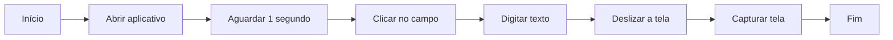
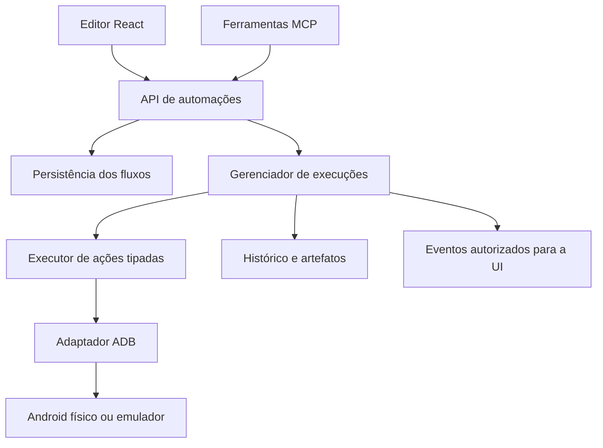

# Automação — proposta de design

- Data: 2026-09-24
- Status: proposta para revisão; não autoriza implementação.
- Branch: `codex/feat-automacao`
- Base: `origin/main` em `d27d7c2cbf254b79c828afd2dd02242844269958`.

## 1. Objetivo e decisões do usuário

Criar a área **Automação** no Frigg para montar fluxos visuais inspirados no n8n, salvar, editar e excluir automações, e executar ações via ADB em um emulador ou Android físico. O MCP deve permitir gerenciar e executar os mesmos fluxos.

O usuário confirmou que quer selecionar blocos e marcar cliques/gestos numa captura da tela do dispositivo. A captura é uma ferramenta para configurar a ação: clicar nela não dispara automaticamente uma ação real. O botão “Testar ação” executa explicitamente o bloco selecionado.

As demais escolhas deste documento são recomendações para revisão. O recorte inicial proposto é um fluxo sequencial, disparado pela interface ou MCP, em um dispositivo selecionado por execução. Condições e repetições são uma decisão de escopo em discussão.

Sucesso: criar um fluxo, posicionar um clique pela captura, conectar outras ações, salvar, executar e acompanhar cada etapa; depois listar, editar, executar e excluir esse mesmo fluxo via MCP, com a interface refletindo as alterações.

## 2. Alternativas

| Abordagem | Vantagem | Custo / limite |
| --- | --- | --- |
| **Canvas React Flow + executor ADB próprio (recomendada)** | Integra com o React existente; domínio e execução compartilhados pela UI e MCP | Frigg implementa validação, execução e histórico |
| Lista ordenada de ações | Menor trabalho de interface para sequências simples | Não atende tão bem à experiência visual solicitada |
| Editor sobre um motor externo de testes mobile | Pode facilitar seletores e esperas em uma etapa futura | Acrescenta runtime, distribuição e tradução de fluxos; exige avaliação específica antes da escolha |

Usar a interação visual do n8n como referência. Não incorporar o servidor do n8n ao Frigg. O React Flow cuida do canvas; o motor do Frigg interpreta o documento de automação, sem depender dos componentes React.

## 3. Experiência proposta

- Nova entrada **Automação / Automation** na navegação.
- Lista com nome, atualização e última execução; ações criar, abrir, duplicar e excluir.
- Editor com biblioteca de blocos à esquerda, canvas no centro e propriedades à direita.
- Cabeçalho com nome, indicação de alterações não salvas, salvar, dispositivo, executar e cancelar.
- Painel de propriedades com parâmetros e captura do dispositivo para selecionar coordenadas. No gesto, marcar início e fim e informar a duração.
- Captura atualizada sob demanda e após “Testar ação”; mostrar momento da captura e dispositivo de origem. Sem streaming de vídeo no primeiro recorte.
- Durante a execução, destacar o bloco atual e mostrar resultado, duração e erro por etapa. A execução continua se o usuário navegar para outra tela.
- Salvar e executar são operações distintas. “Executar” exige uma revisão salva; alterações locais precisam ser salvas antes.
- Atualizações feitas pelo MCP atualizam a lista. Um editor com alterações locais mostra conflito, preservando o rascunho para evitar sobrescrita silenciosa.

Exemplo de fluxo:

## 4. Catálogo inicial recomendado

| Bloco | Parâmetros | Comportamento |
| --- | --- | --- |
| Início / fim | Sem parâmetros | Delimitam a execução |
| Abrir aplicativo | Package instalado | Resolver e abrir a activity de entrada; falhar se indisponível |
| Clique | Ponto na captura | Injetar um toque |
| Pressionar e segurar | Ponto + duração | Gesto estacionário com duração definida |
| Deslizar | Origem, destino e duração | Gesto de um dedo |
| Digitar texto | Texto | Inserir no campo já focado; não selecionar nem limpar o campo automaticamente |
| Tecla | Voltar, Home, Enter, Recentes | Lista explícita de teclas suportadas |
| Aguardar | Milissegundos | Espera cancelável no servidor |
| Capturar tela | Nome opcional | Salvar imagem como artefato da execução |

ADB oferece primitivas de toque, gesto, texto e tecla. O adaptador deve verificar capacidades e reportar falhas do dispositivo, sem exigir root ou configuração do proxy. A captura usa `adb -s <serial> exec-out screencap -p`. A depuração ADB precisa estar autorizada pelo Android.

No primeiro recorte, texto aceita um conjunto de caracteres explicitamente testado; caracteres não suportados devem ser rejeitados antes de executar. Não prometer Unicode completo, emoji ou acentos com `input text`. Espaços e caracteres especiais precisam de tratamento e testes próprios.

Coordenadas são armazenadas normalizadas, acompanhadas da largura, altura e orientação da captura de referência. O clique na imagem desconta zoom, escala e margens da visualização. Antes de executar uma ação, o servidor confere a geometria atual. Nesta primeira versão, divergência de geometria exige remarcar os pontos; não aplicar redimensionamento silencioso. Coordenadas não identificam elementos e não garantem portabilidade entre layouts.

Não entram no recorte inicial: gravação de toques feitos diretamente no aparelho, multitouch/pinch, seletores de elementos, OCR, JavaScript arbitrário, shell livre, iOS, gatilhos por horário, execução paralela ou integração com mocks e tráfego. Essas são evoluções possíveis, não requisitos implícitos de um editor inspirado no n8n.

## 5. Arquitetura e reaproveitamento

O código atual já possui descoberta Android em `packages/server/src/devices/android.ts`, inicialização em `packages/server/src/start.ts`, REST em `packages/server/src/api/router.ts`, persistência atômica em stores locais, UI React/Zustand e wrappers REST no pacote MCP.

Novos limites de responsabilidade propostos:

| Área | Responsabilidade |
| --- | --- |
| `packages/shared/src/automation.ts` | Tipos e enums centrais de blocos, estados, erros, fluxos e execuções; reexportados pelo entrypoint |
| `packages/server/src/automation/validation.ts` | Validar documentos, parâmetros e integridade das conexões |
| `packages/server/src/automation/store.ts` | CRUD, revisões e persistência dos fluxos |
| `packages/server/src/automation/adb.ts` | Comandos tipados, geometria e capturas binárias |
| `packages/server/src/automation/runner.ts` | Percorrer o fluxo e executar etapas em ordem |
| `packages/server/src/automation/manager.ts` | Exclusão mútua por dispositivo, cancelamento e ciclo de vida |
| `packages/server/src/automation/run-store.ts` | Histórico, eventos persistidos e limpeza de artefatos |
| `packages/server/src/automation/router.ts` | Rotas específicas montadas no router existente |
| `packages/web/src/screens/AutomationScreen.tsx` | Lista e integração da área de automação |
| `packages/web/src/components/automation/` | Editor, catálogo, propriedades, captura e histórico |
| `packages/mcp/src/automation.ts` | Registro das ferramentas MCP sobre a mesma API |

O helper atual `lib/exec.ts` retorna UTF-8 e não expõe cancelamento. O adaptador precisa de execução binária e `AbortSignal`, por extensão compatível do helper ou helper específico. Usar processos com argumentos estruturados; ainda assim, tratar o quoting do shell remoto ADB, especialmente para texto. Não aceitar fragmentos arbitrários de comando.

UI e MCP compartilham contratos e validação autoritativa no servidor. O estado do canvas não é o estado da execução. Tipos de domínio e enums ficam em `@frigg/shared`, preservando o pacote sem dependências de UI. Toda string visível tem tradução pt-BR/en.

## 6. Dados e persistência

**Automation:** `id`, `name`, `description`, `schemaVersion`, `revision`, `nodes`, `edges`, `createdAt`, `updatedAt`. Cada nó possui ID estável, tipo do enum central, parâmetros tipados e posição visual. O serial pertence à execução, permitindo reutilizar a definição após conferir a geometria no dispositivo escolhido.

**AutomationRun:** `id`, `automationId`, `automationRevision`, snapshot imutável do fluxo, `deviceSerial`, estado, timestamps, resultados por etapa e referências de artefatos. Estados propostos: iniciando, executando, cancelando, concluída, falhou, cancelada e interrompida. Cada etapa distingue pendente, executando, concluída, falhou e cancelada.

Persistir fluxos em `~/.frigg/automations.json`; runs e imagens em `~/.frigg/automation-runs/<runId>/`. Escritas atômicas e serializadas; confirmar uma mutação somente após persistência. Falha ou corrupção não pode substituir silenciosamente o arquivo por uma lista vazia.

Atualizar exige `expectedRevision`; concorrência entre UI e MCP retorna conflito. Salvar um novo rascunho vazio ou desconectado é permitido, desde que a estrutura e os parâmetros sejam válidos. Executar exige um caminho completo válido. Na proposta sequencial: exatamente um início e um fim, sem ciclos, bifurcações, nós órfãos ou referências inexistentes.

Editar uma automação não altera o snapshot de uma execução já iniciada. Excluir durante uma execução ativa retorna conflito; o usuário cancela e aguarda o término antes de excluir. Excluir remove definição, histórico e artefatos associados. Duplicar cria nova identidade, sem copiar histórico.

Limites iniciais propostos: 100 nós por fluxo, 10 minutos por execução, 60 segundos por espera, 15 segundos por comando ADB e 10 segundos por gesto. Reter até 100 execuções finalizadas, com teto global de 500 MB para artefatos; limpar as mais antigas sem remover execuções ativas. Se o teto não puder ser respeitado, falhar a criação de artefato com erro explícito.

## 7. Contratos REST e MCP

| Operação | REST proposto | Ferramenta MCP proposta |
| --- | --- | --- |
| Catálogo e schemas de blocos | `GET /api/automations/catalog` | `frigg_automation_catalog` |
| Listar | `GET /api/automations` | `frigg_list_automations` |
| Consultar definição | `GET /api/automations/:id` | `frigg_get_automation` |
| Criar | `POST /api/automations` | `frigg_create_automation` |
| Editar | `PUT /api/automations/:id` | `frigg_update_automation` |
| Excluir | `DELETE /api/automations/:id` | `frigg_delete_automation` |
| Validar execução | `POST /api/automations/validate` | `frigg_validate_automation` |
| Executar | `POST /api/automations/:id/runs` | `frigg_run_automation` |
| Listar execuções | `GET /api/automation-runs?automationId=…` | `frigg_list_automation_runs` |
| Consultar andamento | `GET /api/automation-runs/:id` | `frigg_get_automation_run` |
| Cancelar | `POST /api/automation-runs/:id/cancel` | `frigg_cancel_automation_run` |
| Testar bloco | `POST /api/automation-previews` | `frigg_test_automation_action` |
| Capturar tela para edição | `POST /api/automation-devices/:serial/screenshot` | `frigg_automation_screenshot` |
| Ler artefato | `GET /api/automation-runs/:id/artifacts/:artifactId` | `frigg_get_automation_artifact` |

Dispositivos continuam vindo de `frigg_list_devices`. Duplicação pode ser implementada como consultar + criar. Posições visuais podem ser omitidas pelo MCP: aplicar layout determinístico para que o fluxo criado por agente abra legível na UI.

Executar retorna `202` com `runId` imediatamente, depois de validação e aquisição do dispositivo; não manter uma chamada MCP aberta por toda a execução. Testar uma ação cria uma execução curta com o mesmo motor, histórico e trava. `requestId` torna o disparo idempotente: repetir o mesmo pedido devolve a mesma execução, sem repetir toques.

Erros possuem código central, mensagem e, quando aplicável, `nodeId`/campo: definição inválida, revisão conflitante, dispositivo ocupado/offline/não autorizado, geometria incompatível, capacidade ausente, timeout e falha ADB. HTTP distingue validação, ausência e conflito; MCP preserva esses detalhes com `isError`.

Capturas retornam imagem PNG com metadados, usando conteúdo de imagem MCP; não retornar apenas um caminho local inacessível ao cliente. Artefatos são acessados por IDs validados, nunca por caminhos arbitrários enviados pelo consumidor. Listas e detalhes de runs não embutem imagens em base64.

## 8. Execução, falhas e acesso

- Uma execução ativa por serial; tentativa concorrente retorna conflito. Não existe fila implícita. Dispositivos diferentes podem executar independentemente.
- Confirmar dispositivo online, capacidades e geometria antes do primeiro efeito. Usar `-s <serial>` em todos os comandos.
- Parar no primeiro erro; não repetir automaticamente cliques, texto ou gestos. Um timeout pode ocorrer depois de um efeito real no aparelho.
- Cancelar impede novos passos e aborta a espera ou subprocesso local em andamento. Um gesto já enviado ao Android pode terminar; não existe rollback de ações realizadas.
- Desconexão falha a execução. Reinício marca runs incompletas como interrompidas e não retoma nem repete ações automaticamente.
- Ao fechar o servidor, parar novas execuções, cancelar as ativas e persistir seus estados antes de concluir o shutdown.
- Cada evento carrega `runId`, sequência e estado. Reconectar a UI consulta o snapshot autoritativo; perder um evento não deixa a tela presa num estado antigo.

O servidor atual usa `listen(port)` sem host explícito e não apresenta autenticação nas rotas inspecionadas. Antes de expor controle de automação, definir e implementar acesso local autenticado para suas rotas, capturas, artefatos e eventos: credencial local protegida, consumida pelo desktop, navegador local e MCP, com validação de Host/Origin. Não transmitir dados de automação pelo broadcast WebSocket aberto existente. O contrato de provisionamento da credencial deve ser detalhado na etapa de implementação; CORS isoladamente não é autenticação. Esse trabalho é uma dependência da feature, preservando o acesso de dispositivos ao proxy e à página de instalação da CA.

Textos digitados não devem aparecer em logs gerais de comandos. As definições locais podem conter esses valores e as imagens podem conter conteúdo do aparelho; usar permissões restritas nos arquivos e retenção limitada. Variáveis secretas e cofre de credenciais ficam para uma evolução própria.

## 9. Entregas propostas e validação

Esta é a ordem de construção recomendada, ainda sem plano detalhado de implementação:

1. **Contratos e acesso:** modelo versionado, catálogo, validação, revisão concorrente e desenho do acesso autenticado para UI/MCP.
2. **Persistência e CRUD:** criar, listar, editar, excluir e duplicar; verificar reinício, falha de escrita e conflito de revisão.
3. **Adaptador e motor:** comandos, PNG binário, geometria, execução, cancelamento, histórico e bloqueio por serial. Testar com adaptador falso antes do aparelho.
4. **REST e MCP:** expor o mesmo serviço; testar paridade, idempotência, schemas, erros, imagens e restrições de acesso.
5. **Editor visual:** lista, nós/conexões, propriedades, captura, execução e histórico; traduções e estados de conflito/offline.
6. **Validação integrada:** emulador iniciado via AVD-SLIM e um aparelho físico autorizado; criar pela UI e editar pelo MCP e também o inverso. Regenerar o bundle MCP por `scripts/build-plugin.mjs`.

Critérios de aceite:

- CRUD persiste entre reinícios e alterações via MCP aparecem na interface.
- Fluxos incompletos podem ser salvos, mas não executados; informar o nó problemático.
- Ponto marcado numa captura é convertido corretamente com zoom e margens; geometria divergente bloqueia o toque.
- Clique, gesto, texto suportado, tecla, espera e captura funcionam em emulador e aparelho físico da matriz validada.
- Uma falha não dispara a próxima etapa; cancelar durante espera impede o próximo toque.
- Duas execuções no mesmo dispositivo não intercalam comandos.
- Editar não modifica uma execução em andamento; excluir execução ativa é rejeitado.
- Reinício não reproduz comandos; reconectar recupera o estado correto.
- Um cliente não autorizado não executa ações nem lê capturas ou eventos protegidos.
- Builds existentes continuam passando; teste de contrato MCP inclui o bundle distribuído pelo plugin.

## 10. Evolução possível

Após validar o fluxo básico: seletores de UI e “aguardar elemento”, condições, repetição limitada, parâmetros de entrada, ações de HTTP/mocks do Frigg e gatilhos. Gravação de interações e streaming de tela exigem desenho próprio. A separação entre documento, executor e adaptador permite expandir sem trocar o editor inteiro.

## Referências consultadas

- [Android Developers — ADB](https://developer.android.com/tools/adb): seleção de dispositivos, autorização de depuração e captura de tela.
- [AOSP — InputShellCommand](https://android.googlesource.com/platform/frameworks/base/+/master/services/core/java/com/android/server/input/InputShellCommand.java): primitivas de entrada e tratamento de texto. A disponibilidade real depende da versão do dispositivo.
- [React Flow — nós personalizados](https://reactflow.dev/learn/customization/custom-nodes): canvas com componentes e conexões customizados.
- Arquitetura local conferida na base indicada: `CLAUDE.md`, `DESIGN.md`, `start.ts`, `devices/android.ts`, `lib/exec.ts`, `api/ws.ts`, store do API Client e pacote MCP.
