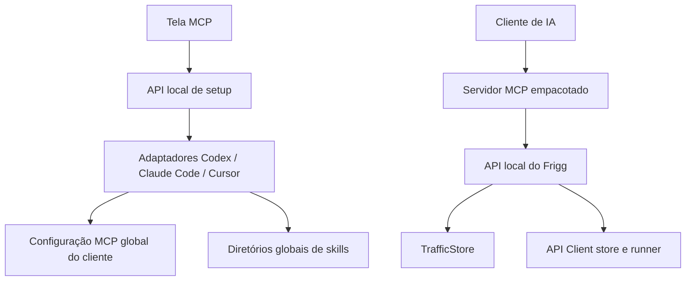

# Instalação de MCP e skills em agentes de IA — proposta de design

- Data: 2026-09-28
- Status: aguardando revisão da especificação
- Branch: `codex/frigg-ai-skills`
- Base: `origin/main` em `9549302880776bcd7662528fcfd31dc84fcef3a6`.

## 1. Objetivo e decisões do usuário

Adicionar skills que ensinem agentes a usar os recursos MCP do Frigg e oferecer, na tela MCP do aplicativo, instalação global para Codex, Claude Code e Cursor. A instalação deve permitir configurar tanto o servidor MCP quanto as skills em cada cliente.

Primeiras skills confirmadas pelo pedido:

- **API Client:** criar e organizar workspaces, coleções, environments e requests; configurar variáveis e executar requests salvas.
- **Inspeção de tráfego:** filtrar capturas, recuperar os detalhes da requisição/resposta selecionada e extrair os campos necessários para análise ou documentação.

As skills existentes de depuração e configuração de interceptação devem continuar disponíveis. A skill de depuração deve passar a usar a ferramenta de detalhes de tráfego proposta abaixo; atualmente `frigg_list_traffic` só retorna um resumo, embora a API já disponha dos dados da captura.

Sucesso: cada cliente exibe o MCP e as skills do Frigg após a instalação global; repetir a instalação atualiza somente os recursos do Frigg; as outras configurações MCP do usuário são preservadas; o agente consegue seguir os dois fluxos iniciais usando as ferramentas correspondentes.

## 2. Alternativas

| Abordagem | Vantagem | Custo / limite |
| --- | --- | --- |
| **Instaladores locais por cliente (recomendada)** | Setup em um clique a partir da tela existente, sem exigir publicação em marketplace | Frigg precisa manter adaptadores e locais de configuração compatíveis com cada cliente |
| Plugin/marketplace para cada cliente | Um pacote distribuível pode agrupar MCP e skills | Fluxos de marketplace variam entre clientes e não oferecem o mesmo setup direto no aplicativo |
| Skills sem instalar MCP | Menor mudança; reaproveita apenas as tools já presentes | Não cumpre o setup global solicitado e a skill de tráfego continua sem acesso aos corpos e headers |

A primeira abordagem atende o resultado pedido e reutiliza o instalador Claude Code já existente. Os adaptadores devem manter o formato de instalação de cada cliente isolado da tela e das skills.

## 3. Experiência na tela MCP

- Mostrar cartões para **Codex**, **Claude Code** e **Cursor**, cada um com o estado do MCP e das skills.
- Disponibilizar ações independentes para instalar/atualizar o MCP e as skills do Frigg. Isso permite corrigir uma instalação sem alterar a outra.
- Mostrar resultado por recurso: instalado, já atualizado, atualizado, cliente ausente, configuração inválida ou erro recuperável com orientação.
- Instalação global é explícita e limitada ao usuário atual. A tela informa quando o cliente precisa reiniciar ou recarregar para descobrir as alterações.
- O status deve considerar arquivos que já configuram o Frigg; não presumir ausência só porque foram instalados fora do Frigg.
- A tela pode mostrar um caminho de configuração para diagnóstico, mas não exibe o conteúdo de secrets ou valores não relacionados ao Frigg.

No estado atual, a tela tem instalação de MCP com um clique apenas para Claude Code e exibe exemplos de configuração para outros clientes. O novo fluxo generaliza essa capacidade sem remover o modo manual.

## 4. Distribuição e instalação das skills

As skills serão diretórios portáteis com `SKILL.md`, nome, descrição e instruções de fluxo. Uma fonte canônica no repositório abastece o plugin Claude existente e os arquivos enviados aos diretórios globais dos clientes. As skills não devem conter caminhos locais fixos nem assumir que o Frigg usa a porta padrão; devem usar o MCP conectado e consultar `frigg_status` quando precisarem validar disponibilidade.

Os diretórios globais documentados são:

| Cliente | Diretório global recomendado |
| --- | --- |
| Codex | `$HOME/.agents/skills/` |
| Claude Code | `$HOME/.claude/skills/` |
| Cursor | `$HOME/.cursor/skills/` |

O Cursor também descobre skills nos diretórios globais do Codex e do Claude. O instalador deve reconhecer caminhos compartilhados, evitar cópias redundantes e apresentar o estado efetivamente visível em cada cliente. Skills devem compartilhar nomes e conteúdo; ao atualizar, substituir somente os diretórios gerenciados pelo Frigg. Arquivos locais com o mesmo nome e conteúdo não reconhecido como gerenciado não devem ser apagados silenciosamente.

Conteúdo inicial:

### `frigg-api-client`

1. Consultar `frigg_status` e `frigg_client_snapshot` antes de alterar dados.
2. Identificar se o workspace já existe e evitar duplicá-lo.
3. Criar workspace, collection/folder, environment, request e variáveis usando as tools MCP existentes.
4. Revisar método, URL, headers, query, body e variáveis antes de executar.
5. Executar apenas quando o pedido do usuário incluir execução; retornar status, URL efetiva, duração, erros e resultados dos testes.
6. Não inventar credenciais nem gravar tokens recebidos em texto claro como variáveis sem pedido explícito.

### `frigg-traffic-inspector`

1. Confirmar que o Frigg está acessível e que há capturas disponíveis.
2. Usar `frigg_list_traffic` para selecionar IDs relevantes por host, URL, método e status.
3. Recuperar detalhes só das capturas selecionadas com uma nova tool MCP `frigg_get_traffic_detail`.
4. Separar dados da requisição e da resposta, manter a indicação de bodies truncados/binários e citar os IDs analisados.
5. Redigir resumos, tabelas ou exemplos de chamada apenas com os campos pedidos; mascarar `Authorization`, cookies e valores que pareçam tokens na saída, salvo quando o usuário solicitar explicitamente o valor original.
6. Não limpar capturas nem criar mocks durante uma tarefa apenas de leitura.

### Skills existentes

- Manter `frigg-debug` e `frigg-android-setup` na instalação global e no plugin Claude.
- Corrigir `frigg-debug` para usar `frigg_get_traffic_detail` antes de instruir a IA a examinar headers e bodies.
- Revisar descrições e instruções para que não dependam de slash commands exclusivos do Claude.

## 5. Arquitetura proposta

| Unidade | Responsabilidade |
| --- | --- |
| `plugin/skills/` ou diretório canônico equivalente | Fonte versionada das skills e recursos compartilhados |
| `packages/server/src/api/mcp-info.ts` e serviço de setup a extrair | Resolver entrada MCP, clientes suportados, estados e caminhos globais; aplicar instalação idempotente |
| `packages/server/src/api/router.ts` | Expor leitura de status e operações de instalação para a UI |
| `packages/shared/src/index.ts` | Contratos tipados de estado, cliente e resultado do setup |
| `packages/web/src/screens/McpScreen.tsx` e `packages/web/src/i18n/mcp.ts` | Ações e estados por cliente, traduzidos em pt-BR e inglês |
| `packages/mcp/src/index.ts` | Registrar `frigg_get_traffic_detail` e devolver dados tipados de uma captura |
| `packages/desktop/package.json` e build do plugin | Incluir skills e o MCP empacotado nos artefatos distribuídos |

Usar um registro explícito dos três clientes e adaptadores de configuração. Para Codex, usar a CLI MCP global. Para Claude Code, usar `claude mcp add` com escopo de usuário. Para Cursor, mesclar a entrada `frigg` em `~/.cursor/mcp.json`. O aplicativo deve detectar a ausência da CLI quando necessário e manter disponível a orientação manual.

O instalador do Cursor deve ler o JSON existente, validar sua estrutura, adicionar ou atualizar apenas `mcpServers.frigg` e gravar de forma atômica. As demais entradas permanecem byte-a-byte equivalentes no conteúdo lógico. Para Codex e Claude Code, passar argumentos como elementos separados ao processo; não interpolar comandos em shell. O caminho do entrypoint empacotado deve apontar para o bundle incluído em `process.resourcesPath`, e o ambiente deve usar a porta efetiva retornada por `mcpServerInfo`.

As skills devem ser empacotadas como recursos do app desktop e lidas do checkout durante o desenvolvimento. Nenhuma instalação pode depender do checkout de desenvolvimento continuar no mesmo caminho após o usuário instalar o Frigg.

## 6. Contrato MCP de detalhes de tráfego

`frigg_list_traffic` continua sendo a descoberta leve e retorna os IDs das capturas. Acrescentar:

| Tool | Entrada | Saída |
| --- | --- | --- |
| `frigg_get_traffic_detail` | `id` obrigatório; opção de limite de bytes por body | Estado da captura, metadados completos da request e response presentes, incluindo headers, body (`encoding`, tamanho e `truncated`), duração e `mockRuleId` quando houver |

Uma captura pending/aborted pode não ter response; a saída deve preservar essa distinção. IDs inexistentes retornam erro MCP explícito. O limite por body deve ser validado para que duas capturas de tamanho máximo não produzam saída sem limite; truncamento adicional feito pela tool também precisa ser indicado. O endpoint REST `/api/traffic` já fornece o `TrafficExchange` completo, portanto a primeira versão pode selecionar por ID no lado MCP sem adicionar outra rota REST.

Não incluir ferramenta de limpeza nesta skill nem disparar operações mutáveis para ler dados. `frigg_clear_traffic` continua disponível separadamente.

## 7. Persistência, colisões e falhas

- Escrever apenas nos arquivos de configuração e diretórios globais do usuário atual.
- Operações repetidas são idempotentes. Uma instalação parcial de MCP ou skills pode ser corrigida sem reinstalar o que já está válido.
- Manter em `~/.frigg/agent-integrations.json` um registro de cliente, recurso, caminho, versão e hash dos arquivos escritos pelo Frigg; não registrar credenciais, tráfego ou conteúdo de configuração de outros servidores.
- Configuração JSON inválida, toml incompatível, cliente não encontrado ou diretório sem permissão produz erro específico; não sobrescrever arquivo que não foi possível interpretar.
- Quando já existir uma entrada chamada `frigg`, atualizar somente se ela corresponder à instalação que o registro do Frigg gerencia. Se houver uma entrada homônima não gerenciada ou editada externamente, apresentar conflito com opção explícita de substituir; preservar os demais servidores. Não remover configuração nem skills automaticamente.
- Se o nome de uma skill já existir sem registro do Frigg, não sobrescrever; apresentar conflito e manter a versão existente até o usuário escolher substituir.
- Se escrita de skills falhar, preservar a versão anterior. Preparar conteúdo em diretório temporário no mesmo volume e renomear no final.
- Não registrar bodies, headers, secrets ou conteúdo completo das configurações em logs do servidor.
- As rotas de instalação executam processos locais e escrevem arquivos fora do projeto. Restringir essas operações ao acesso local confiável do desktop; não torná-las acionáveis por tráfego de dispositivos na LAN.

## 8. Limites e fora de escopo

- O primeiro recorte instala globalmente apenas Codex, Claude Code e Cursor, nos sistemas desktop já suportados pelo Frigg; não inclui instalação por projeto.
- Manter o servidor MCP local via stdio; não publicar um serviço MCP remoto nem abrir novas portas.
- Não instalar ou atualizar os próprios clientes de IA.
- Não publicar plugins em marketplaces nesta entrega.
- Não criar uma biblioteca de skills de terceiros nem permitir instalar skills arbitrárias baixadas da internet.
- Não remover configurações ou skills do usuário ao desinstalar Frigg.
- A extração de tráfego é somente leitura; exportação persistente em arquivo, execução de requests, limpeza e criação de mocks permanecem fluxos separados.

## 9. Entrega e critérios de aceite

Ordem recomendada para o plano de implementação:

1. Definir contratos e fonte canônica das skills; adequar skills existentes e acrescentar API Client e inspeção de tráfego.
2. Adicionar a tool de detalhe MCP, com erros de captura inexistente e limite explícito de body.
3. Extrair o serviço de setup e implementar status/instalação global para Codex, Claude Code e Cursor, preservando configurações alheias e protegendo as rotas contra chamadas vindas da LAN.
4. Empacotar as skills no app desktop e plugin Claude.
5. Adicionar os três cartões e estados de instalação na tela MCP, com traduções.

Critérios de aceite:

- Cada cliente mostra se o MCP está configurado e se as skills estão disponíveis globalmente.
- Instalar/atualizar cada recurso em cada cliente funciona sem modificar configuração ou arquivos de outros clientes.
- Repetir a instalação não duplica o servidor nem as skills.
- Colisões com entradas MCP ou diretórios de skills que não pertencem ao Frigg são reportadas antes de qualquer substituição.
- As outras entradas MCP de Cursor, Codex e Claude permanecem configuradas.
- Skills são encontradas após recarregar/reiniciar o agente e usam somente tools disponíveis no Frigg MCP.
- A skill API Client segue a sequência de inspeção, evita workspaces duplicados e só executa requests quando pedido.
- A skill de tráfego descobre por resumo, lê detalhes apenas das capturas selecionadas, identifica truncamento e não altera o estado do Frigg.
- A saída padrão da skill de tráfego mascara tokens e cookies; bodies binários mantêm encoding e tamanho sem serem tratados como texto.
- Capturas pending, aborted e IDs inexistentes têm respostas distintas e claras.
- Build do plugin inclui as skills; build desktop inclui os mesmos arquivos para uso fora do repositório.
- Um request remoto vindo da rede de dispositivos não consegue acionar a instalação local de MCP/skills.

## 10. Referências consultadas

- [Codex — criação e descoberta de skills](https://learn.chatgpt.com/docs/build-skills): diretório pessoal `$HOME/.agents/skills` e integração com plugins.
- [Claude Code — skills](https://code.claude.com/docs/en/skills): diretório pessoal `~/.claude/skills` e instalação global via CLI com escopo `user`.
- [Cursor — Agent Skills](https://cursor.com/docs/skills): diretórios globais e descoberta de skills do Codex/Claude.
- [Cursor — integração MCP](https://prod.cursor.com/help/customization/mcp): configuração global em `~/.cursor/mcp.json`.
- Arquitetura local conferida na base `9549302`: `packages/mcp/src/index.ts`, `packages/server/src/api/mcp-info.ts`, `packages/server/src/api/router.ts`, `packages/shared/src/index.ts`, `packages/web/src/screens/McpScreen.tsx`, `plugin/skills/`, `scripts/build-plugin.mjs` e empacotamento do Electron.
